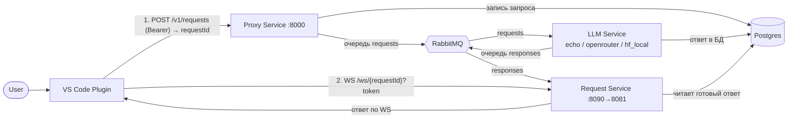

# VS Code AI Agent + асинхронный бэкенд

Проект состоит из **VS Code-плагина** (агент для написания кода) и **серверной части** из четырёх
сервисов + БД + очередь. Плагин больше не ходит в LLM напрямую: он отправляет запрос на сервер,
получает `requestId` и читает ответ по WebSocket. Запросы логируются в БД, инференс крутится в
отдельном сервисе через сменные адаптеры моделей.

> Как запустить и пользоваться — см. **[START.md](START.md)**.
> Детали серверной части — см. **[server/README.md](server/README.md)**.

---

## Что было сделано

1. **Асинхронный бэкенд** (`server/`) по схеме «плагин → Proxy → очередь → LLM → очередь → Request → плагин»:
   Proxy Service, LLM Service, Request Service, RabbitMQ и Postgres, всё поднимается одним `docker compose`.
2. **Адаптация плагина** — заменён только транспорт: вместо синхронного HTTP в OpenRouter теперь
   `POST` в Proxy → `requestId` → WebSocket в Request Service. Формат ответа (OpenAI `chat.completion`)
   сохранён, поэтому agent-loop, инструменты и UI не менялись.
3. **Список и выбор моделей** — сервер отдаёт доступные модели (`GET /v1/models`), в настройках плагина
   появился выпадающий список и кнопка «Загрузить модели».
4. **Локальная Qwen MoE на CUDA** — модель `Qwen/Qwen1.5-MoE-A2.7B-Chat` через адаптер `hf_local`
   с автоопределением устройства (CUDA→MPS→CPU) при старте сервиса.

---

## Архитектура



| Сервис | Стек | Порт (host) | Роль |
|---|---|---|---|
| **Proxy Service** | FastAPI | `8000` | проверяет токен, пишет запрос в БД, кладёт в очередь `requests`, отдаёт `requestId`; проксирует `/v1/models` |
| **Request Service** | FastAPI + WebSocket | `8090` → 8081 | держит WS по `requestId`, читает очередь `responses`, отдаёт ответ (в т.ч. если он уже готов) |
| **LLM Service** | FastAPI + воркер | `8002` (внутр.) | читает `requests`, гоняет модель через **адаптер**, пишет ответ в БД, шлёт в `responses` |
| **Queue** | RabbitMQ | `5672`, UI `15672` | очереди `requests` и `responses` |
| **Database** | Postgres | `5432` | лог запросов: запрос + статус + ответ |

### Пайплайн одного запроса
1. Плагин собирает контекст (активный файл, импорты, тесты) и `POST /v1/requests` с `Authorization: Bearer <token>`.
2. **Proxy** проверяет токен → создаёт `requestId` → пишет строку в Postgres (`status=queued`) → кладёт `{requestId}`
   в очередь `requests` → возвращает плагину `requestId`.
3. **LLM Service** читает `requests` → берёт payload из БД (`status=processing`) → выбирает адаптер по `model` →
   инференс → пишет ответ в БД (`status=done`) → кладёт `{requestId, status}` в очередь `responses`.
4. Плагин открывает **WebSocket** `…/ws/{requestId}?token=…` к **Request Service**.
5. **Request Service**: если ответ уже в БД — сразу отдаёт (**connect-after**); иначе ждёт сигнал из очереди
   `responses` и отдаёт, как только готово (**connect-before**). Плагин закрывает WS.

---

## Паттерн «Адаптер» для моделей

Все адаптеры реализуют единый интерфейс `BaseModelAdapter.generate(ChatRequest) → OpenAI chat.completion`,
поэтому вход/выход одинаков независимо от бэкенда. Состав моделей задаётся в `server/models.json`
(несколько записей = несколько «поднятых» моделей), выбор по полю `model`.

| Адаптер | Что делает | Требования |
|---|---|---|
| `echo` | эхо последнего сообщения (офлайн-демо) | ничего |
| `openrouter` | форвардит запрос в OpenAI-совместимый API; tool-calling нативный | `OPENROUTER_KEY` |
| `hf_local` | локальная HuggingFace-модель (Qwen MoE), устройство — авто (CUDA→MPS→CPU) | `torch` (только CUDA-образ) |

Если зависимость адаптера недоступна (например `torch` в обычном CPU-образе) — модель **тихо пропускается**
реестром и не появляется в `/v1/models`.

---

## Контракты (HTTP / WS / очереди)

- `POST /v1/requests` (Bearer) → `200 {"requestId":"..."}`, `401` при неверном токене.
- `GET /v1/models` → `{"models":[{"id","adapter","default"}]}` (без токена — метаданные).
- `GET /health` → `{"status":"ok"}` (у LLM ещё `"device"`).
- WS `…/ws/{requestId}?token=…` → `{"type":"response","payload":<completion>}` либо `{"type":"error","error":"..."}`.
- Очередь `requests`: `{"requestId"}`; очередь `responses`: `{"requestId","status"}` (данные — в БД, единый источник истины).
- Токены доступа — общий файл `server/tokens.json`, монтируется в Proxy и Request Service, перечитывается по mtime.

---

## Раскладка репозитория

```
vs-code-ai-plugin/
├── README.md                 # этот файл
├── START.md                  # гайд по запуску и использованию
├── server/                   # серверная часть
│   ├── docker-compose.yml        # postgres, rabbitmq, proxy, request, llm
│   ├── docker-compose.cuda.yml   # override для GPU-хоста (CUDA + Qwen MoE)
│   ├── tokens.json / models.json # общие конфиги (токены / реестр моделей)
│   ├── test_client.py            # автономная проверка пайплайна без VS Code
│   ├── common/                   # config, db, models, rabbit, tokens, schemas
│   ├── proxy_service/  request_service/
│   └── llm_service/              # main + device.py + adapters/{base,registry,echo,openrouter,hf_local}
└── vs-ext-ai-plugin/         # VS Code-плагин (адаптирован под бэкенд)
    ├── src/agent/OpenRouterClient.js   # транспорт: POST→Proxy, WS→Request, listModels()
    └── src/ui/AssistantViewProvider.js # настройки: выбор модели + «Загрузить модели»
```

Стек сервера: FastAPI + uvicorn, aio-pika (RabbitMQ), SQLAlchemy[asyncio] + asyncpg (Postgres),
pydantic / pydantic-settings, httpx; опц. transformers/torch (CUDA-образ).

---

## Статус проверки

✅ Проверено локально (CPU-стек): полный пайплайн (connect-before и connect-after), проверка токена
(`401` / WS reject), логи в БД (`queued→processing→done`), `GET /v1/models`, `listModels()` из плагина,
автоопределение устройства (приоритет CUDA→MPS→CPU), авто-пропуск MoE без torch, валидность CUDA-compose.

⚠️ **CUDA + Qwen MoE** реализованы и провалидированы конфигом, но **запускаются только на NVIDIA-хосте**:
у Docker Desktop на Mac нет проброса GPU, а MPS недоступен внутри Linux-контейнера. На Mac базовый стек
работает на CPU с `mock/echo` (и `openrouter` при наличии ключа); тяжёлую MoE поднимайте на GPU-машине.
